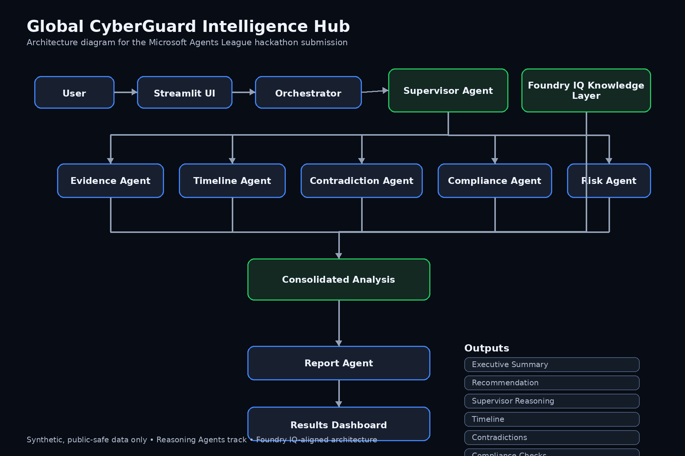
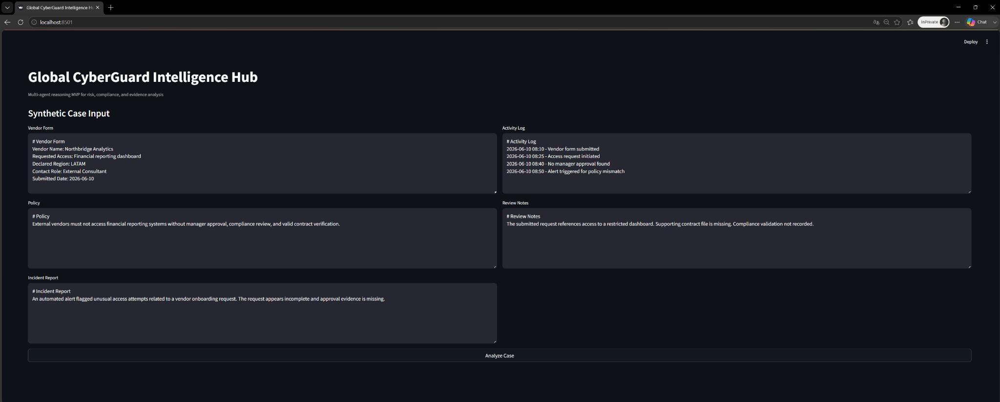
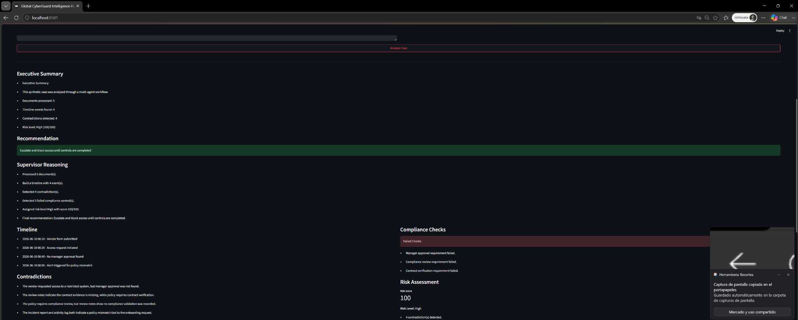
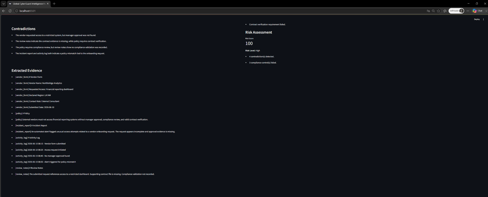

# Global CyberGuard Intelligence Hub

## Overview

Global CyberGuard Intelligence Hub is a multi-agent reasoning system designed to analyze synthetic risk and compliance cases where evidence is fragmented across documents, logs, reports, and notes.

The system coordinates specialized agents to extract facts, build a timeline, detect contradictions, evaluate compliance, assess risk, and generate a final report.

## Hackathon Track

**Reasoning Agents**

## Microsoft IQ Layer

**Foundry IQ**

The architecture is designed to use Foundry IQ as the grounding and enterprise knowledge layer for cited, context-aware retrieval and reduced hallucination risk.

## Problem

Complex cases are often reviewed manually across multiple disconnected sources. This creates delays, weak traceability, inconsistent decisions, and higher operational risk.

## Solution

A multi-agent workflow that:

* extracts evidence,
* organizes chronology,
* detects contradictions,
* checks policy alignment,
* scores risk,
* and produces a final recommendation.

## Agent Roles

* **Supervisor Agent**: coordinates the full workflow
* **Evidence Agent**: extracts relevant facts
* **Timeline Agent**: orders events chronologically
* **Contradiction Agent**: identifies conflicts across sources
* **Compliance Agent**: checks alignment with policy requirements
* **Risk Agent**: estimates severity level
* **Report Agent**: generates the final report

## Input Files

Synthetic case documents stored in `/data`:

* `vendor_form.md`
* `policy.md`
* `incident_report.md`
* `activity_log.md`
* `review_notes.md`

## Project Structure

```text
docs/
data/
src/
demo/
README.md
requirements.txt
.gitignore
```

## Run Locally

```bash
cd src
python -m streamlit run app.py
```

## Expected Output

The application returns:

* executive summary
* recommendation
* supervisor reasoning
* timeline
* contradictions
* compliance findings
* risk score
* extracted evidence

## Architecture

The system uses a multi-agent orchestration pattern:

1. The user submits a synthetic case
2. The Orchestrator passes the case to the Supervisor Agent
3. The Evidence Agent extracts relevant facts
4. The Timeline Agent orders events
5. The Contradiction Agent identifies inconsistencies
6. The Compliance Agent checks policy alignment
7. The Risk Agent scores severity
8. The Report Agent generates the final report

Foundry IQ is represented as the grounding knowledge layer in the architecture design.

## Architecture Diagram



## Safety and Compliance

This project uses only synthetic, non-confidential data and is designed to avoid:

* secrets
* API keys
* tokens
* personally identifiable information
* internal proprietary information
* restricted or private materials

## Screenshots

### Input Screen



### Results Summary



### Results Details



## Demo Goal

Demonstrate how a multi-agent reasoning system can support faster, more structured, and more reliable case analysis.

## Notes

This MVP focuses on transparent reasoning, structured analysis, and public-safe synthetic data for demonstration purposes.
